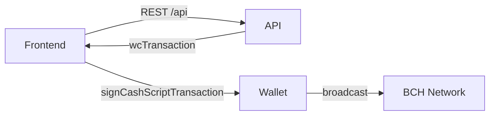
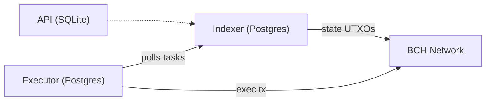
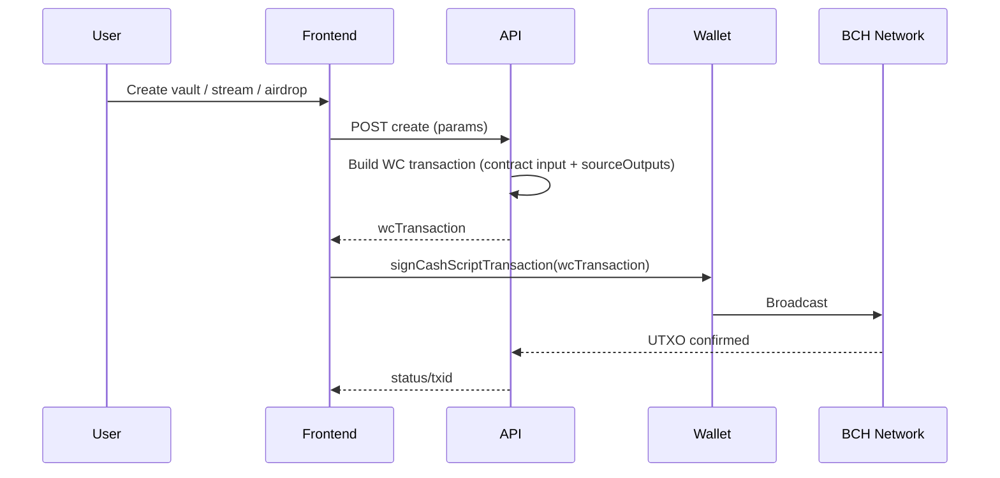
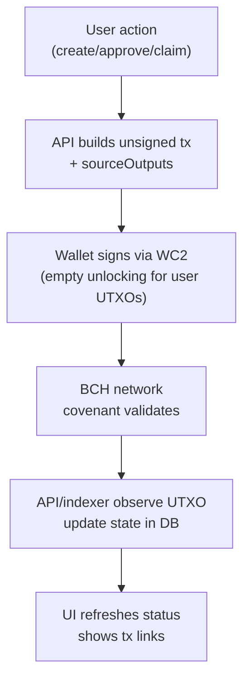

# FlowGuard

FlowGuard is a CashToken powered streaming and recurring payment protocol that encodes financial coordination logic directly into BCH UTXOs, enabling programmable treasury systems and token native economic flows. It turns BCH from static value storage into programmable value flow.

## Components
* Frontend: React and Vite (`frontend/`), WalletConnect v2 (Paytaca, Selene), talks to `/api`.
* Backend API: Express and TypeScript (`backend/`), builds WC transactions, stores state in SQLite (better sqlite3) by default.
* Indexer (optional): Postgres based chain indexer (`backend/indexer/`) for richer explorer and state queries.
* Executor (optional): Postgres based automation worker (`backend/executor/`) to auto execute ready tasks.
* Contracts: CashScript covenants (`contracts/`) compiled to `contracts/artifacts/`.

## Quick Start (Chipnet dev)
```bash
pnpm install

# Contracts
cd contracts && pnpm run build

# Backend (SQLite)
cd ../backend
cp .env.example .env
pnpm dev

# Frontend
cd ../frontend
pnpm dev
```
Open http://localhost:5173 (wallet on chipnet).

## Environment
Backend (`backend/.env`):
* `PORT` default 3001
* `BCH_NETWORK=chipnet|mainnet`
* `DATABASE_PATH=./flowguard.db` (use a mounted volume in prod)
* Optional: `CHAINGRAPH_URL`

Indexer (`backend/indexer/.env`):
* `DATABASE_URL` (Postgres)
* `BCH_NETWORK`, `ELECTRUM_SERVER`
* `START_BLOCK`, `CONFIRMATIONS`, `POLL_INTERVAL`

Executor (`backend/executor/.env`):
* `DATABASE_URL` (same Postgres as indexer)
* `BCH_NETWORK`, `ELECTRUM_SERVER`
* `POLL_INTERVAL`, `MAX_GAS_PRICE`
* Optional `EXECUTOR_PRIVATE_KEY` (WIF) to pay fees

Frontend:
* `VITE_API_BASE_URL` pointing to backend host

## Build
```bash
# contracts
cd contracts && pnpm run build
# backend
cd ../backend && pnpm build
# frontend
cd ../frontend && pnpm build
```

## Deployment
* Frontend: Vercel (static `frontend/dist`, set `VITE_API_BASE_URL`).
* Backend API: Railway (Dockerfile), mount volume `/data` and set `DATABASE_PATH=/data/flowguard.db`.
* Indexer (optional): Railway service with Postgres add on; run `pnpm build && node dist/index.js`.
* Executor (optional): Railway service with Postgres; run `pnpm build && node dist/index.js`.

## Architecture (mermaid, focused views)

### User -> API -> Wallet


### Optional services


## Data flow (create and sign)


## How it works (at a glance)


## Wallets
* Tested: Paytaca, Selene (WC2 `bch_signTransaction` with `sourceOutputs`).
* CashTokens share the same cashaddr; no separate token address.

## Status and Safety
* Designed and wired for chipnet; mainnet use only after audits and your own testing.
* Backend cannot override covenant rules; funds remain non custodial.

## License
MIT
