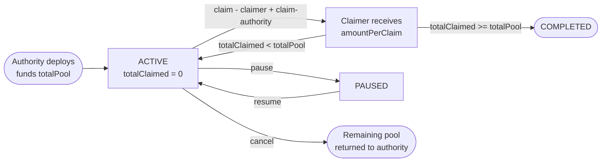

`AirdropCovenant` lets eligible addresses claim a fixed `amountPerClaim` from a funded pool. Claims require two signatures: the claimer and a backend-held claim-authority key. Authority controls campaign-level pause, resume, and cancel.

## Use Cases

- Token launches and community drops
- Protocol incentive distributions
- Retroactive user rewards

## How It Works



## Key Properties

| Property | Detail |
|-|-|
| Claim amount | Fixed. Identical for every claimer. |
| Eligibility | Enforced off-chain by claim-authority co-signing policy (open or merkle/KYC). |
| Time window | Optional `startTimestamp` and `endTimestamp` |
| Pool behavior | Auto-completes when `totalClaimed >= totalPool` |
| Authority | Can pause, resume, or cancel. Cancel returns remainder. |

## NFT State

```
[0]:    status
[1]:    flags
[2-9]:  total_claimed (uint64)
[10-17]: claims_count (uint64)
[18-22]: last_claim_timestamp (5 bytes)
[23-39]: reserved
```

## Creating an Airdrop

See [Create an Airdrop](/guides/airdrops/create) for the step-by-step guide.

## Contract Reference

See [AirdropCovenant](/reference/contracts/airdrop-covenant) for full parameter and function documentation.
