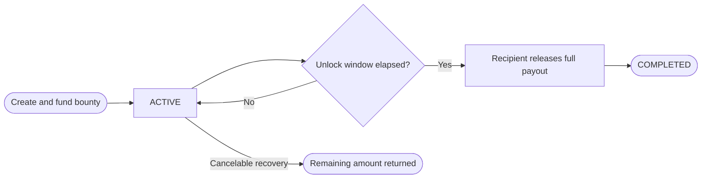

In the current product, FlowGuard bounties are presented as single-stage budget-style releases tied to one deliverable and one recipient. They are best understood as a one-milestone payout pattern rather than a multi-winner competition surface.

## Use Cases

- bug fixes and feature implementations
- one-off contributor tasks
- paid deliverables with a single payout
- time-locked completion payouts

## How It Works

## Key Properties

| Property               | Detail                                    |
| ---------------------- | ----------------------------------------- |
| Payout shape           | Single full release                       |
| Recipient count        | One recipient in the current product flow |
| Timing                 | Unlocks after the configured duration     |
| Cancel path            | Controlled by the bounty settings         |
| Typical funding source | personal or treasury budget               |

## Contract Library Note

FlowGuard also includes a dedicated `BountyCovenant` in the contract library for proof-based multi-winner bounty flows. The current app documentation here focuses on the bounty experience users actually interact with today.
