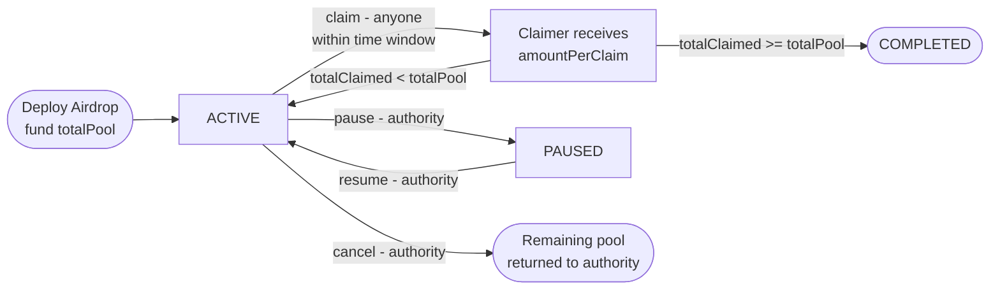
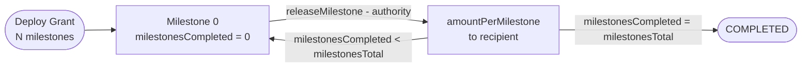

FlowGuard provides four distribution covenant types, each tailored to a specific payout pattern.

## Airdrops

`AirdropCovenant` enables fixed-amount, self-service token campaigns. Any eligible address can call `claim()` and receive `amountPerClaim`. Claims are time-gated by `startTimestamp` and `endTimestamp`.

**Key parameters:** `amountPerClaim`, `totalPool`, `startTimestamp`, `endTimestamp`

## Grants

`GrantCovenant` releases funding in discrete tranches as milestones are completed. The authority calls `releaseMilestone()` to approve each tranche. The grant recipient is mutable — if `FLAG_TRANSFERABLE` is set, the recipient can transfer the grant.

**Key parameters:** `milestonesTotal`, `amountPerMilestone`, `totalAmount`

## Bounties

`BountyCovenant` funds a competition where multiple winners each receive `rewardPerWinner`. The authority verifies submissions off-chain and co-signs `claim()` with a `proofHash` identifying the work.

**Use cases:** code bounties, bug bounties, design competitions, research prizes

**Key parameters:** `rewardPerWinner`, `maxWinners`, `startTimestamp`, `endTimestamp`

The contract tracks `winners_count` and auto-completes when `winners_count >= maxWinners`.

## Rewards

`RewardCovenant` is the most flexible distribution type. The authority calls `reward()` with a variable `rewardAmount` (up to `maxRewardAmount`) for each event. Four reward categories are encoded in the NFT state: `ACHIEVEMENT` (1), `REFERRAL` (2), `LOYALTY` (3), `CUSTOM` (4).

**Key parameters:** `maxRewardAmount`, `totalPool`, `startTimestamp`, `endTimestamp`

## Comparison

| Feature | Airdrop | Grant | Bounty | Reward |
|-|-|-|-|-|
| Claimer | Anyone (self-claim) | Authority triggers | Authority co-signs | Authority triggers |
| Amount per event | Fixed | Fixed per milestone | Fixed per winner | Variable (0..maxReward) |
| Multi-recipient | Yes (sequential) | No (single) | Yes (up to maxWinners) | Yes (sequential) |
| Work proof required | No | Milestone approval | Yes (proofHash) | No |
| Recipient transferable | No | Yes (optional) | No | No |
