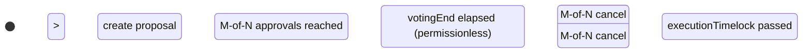
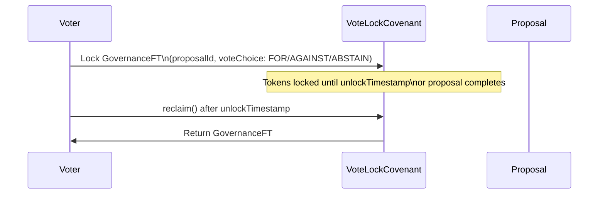

-
title: "Governance"
description: "On-chain proposal lifecycle with M-of-N approval counting and token-weighted vote locking."
icon: "landmark"
-

FlowGuard governance is composed of two contracts: `ProposalCovenant` (manages spending proposal lifecycle) and `VoteLockCovenant` (locks governance tokens as immutable vote commitments).

## Proposal Lifecycle



### ProposalCovenant Status Codes

| Status | Value | Description |
|-|-|-|
| `PENDING` | `0` | Awaiting approvals |
| `APPROVED` | `1` | Quorum reached, waiting for execution timelock |
| `EXECUTED` | `2` | Proposal carried out, NFT burned |
| `CANCELLED` | `3` | Withdrawn by M-of-N signers |
| `EXPIRED` | `4` | Voting deadline passed without quorum |

## ProposalCovenant NFT State (40 bytes)

```
[0]:    version
[1]:    status
[2]:    approval_count (uint8)
[3]:    required_approvals (uint8)
[4-8]:  voting_end_timestamp (5 bytes)
[9-13]: execution_timelock (5 bytes)
[14-33]: payout_hash (bytes20)
[34-39]: reserved
```

## Vote Locking

`VoteLockCovenant` locks governance FTs with an immutable vote choice. The UTXO model on BCH makes double-voting cryptographically impossible: spending the lock UTXO IS the vote cast. The same tokens cannot exist in two places simultaneously.



### VoteLockCovenant Parameters

| Parameter | Description |
|-|-|
| `proposalId` | Links vote to specific proposal (`bytes32`) |
| `voteChoice` | Immutable: 0=AGAINST, 1=FOR, 2=ABSTAIN |
| `voterHash` | `hash160` of voter pubkey — prevents theft |
| `unlockTimestamp` | When tokens can be reclaimed |

### VoteLockCovenant NFT State (32 bytes)

```
[0]:    version
[1-4]:  proposal_id_prefix (first 4 bytes of proposalId)
[5]:    vote_choice
[6-7]:  reserved
[8-12]: lock_timestamp (5 bytes)
[13-17]: unlock_timestamp (5 bytes)
[18-31]: reserved
```

## Early Reclaim

After a proposal reaches `EXECUTED`, `CANCELLED`, or `EXPIRED`, voters no longer need to wait for `unlockTimestamp`. They can call `earlyReclaim()` and supply the `proposalFinalStatus` to prove the proposal is done.

<Note>
Because there is no cross-UTXO read on BCH, the voter must supply `proposalFinalStatus` as a parameter. The caller is responsible for providing the correct status. The covenant validates it falls within the set {EXECUTED=2, CANCELLED=3, EXPIRED=4}.
</Note>
