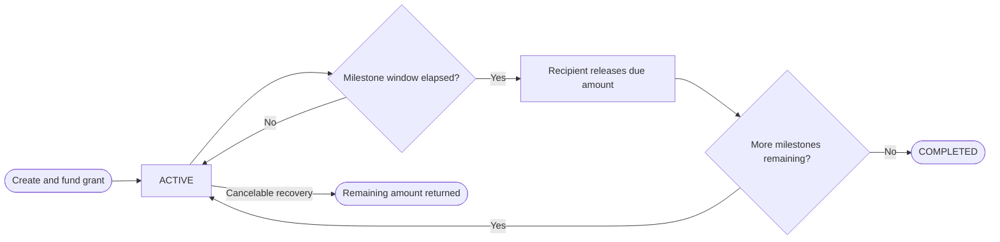

FlowGuard grants are milestone-based budget plans. They lock funding up front, then release it in scheduled stages as each milestone window becomes claimable on-chain.

## Current Product Model

In the app today, grants are powered by the budget-plan flow rather than a separate dedicated grant screen. That means a grant behaves like a treasury-funded milestone release schedule with:

- one recipient
- a funded total amount
- milestone timing between releases
- on-chain release gating
- release history in the product

## How It Works

## Key Properties

| Property        | Detail                                                                    |
| --------------- | ------------------------------------------------------------------------- |
| Funding model   | Entire grant is funded up front                                           |
| Release control | Recipient triggers release when a milestone window is due                 |
| Timing          | Each milestone uses a configured interval from the prior release schedule |
| Asset support   | BCH and CashTokens                                                        |
| Cancel behavior | Controlled by plan settings and remaining unreleased balance              |

## What Is Enforced On-Chain

- milestone timing
- releasable amount
- remaining contract state after each release
- final completion when the funded amount is exhausted

## Relationship to the Contract Library

FlowGuard also ships a `GrantCovenant` in the contract library. The current app experience, however, documents the live budget-plan milestone workflow that users interact with today.

## Contract Reference

See [GrantCovenant](/reference/contracts/grant-covenant) for the lower-level contract reference, and [Create a Grant](/guides/grants/create) for the product guide.
