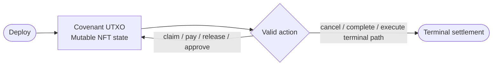

FlowGuard is built on two BCH-native primitives:

- **CashScript covenants**, which constrain how a UTXO can be spent
- **CashTokens**, which provide fungible assets and mutable NFT state commitments

Together they let FlowGuard run treasury, stream, distribution, and governance products without turning BCH into an account-based system.

## Shared Product Pattern

Every major FlowGuard product follows the same pattern:

1. **Deploy** a covenant with immutable rules in bytecode
2. **Store mutable runtime state** in a mutable CashToken NFT commitment
3. **Advance state** by consuming the current covenant UTXO and producing the next valid one
4. **Finish** by consuming the covenant UTXO without producing a replacement state output

## Shared Status Model

| Status | Meaning |
| --- | --- |
| `ACTIVE` | contract is live and can transition |
| `PAUSED` | contract is temporarily frozen |
| `CANCELLED` | contract ended early |
| `COMPLETED` | contract fulfilled its final state |

## Shared Flags Model

| Bit | Mask | Meaning |
| --- | --- | --- |
| 0 | `0x01` | cancelable |
| 1 | `0x02` | transferable |
| 2 | `0x04` | uses CashTokens rather than BCH |

## Product Families

FlowGuard currently covers:

- vaults
- streams and recurring payments
- airdrops
- grants
- bounties
- rewards
- proposals and governance voting

## Treasury Linkage

Many FlowGuard products can be linked back to a treasury workflow through `vaultId` and launch context metadata. That gives the UI and API a way to present the same contract-backed product surface in both personal and organization contexts.
