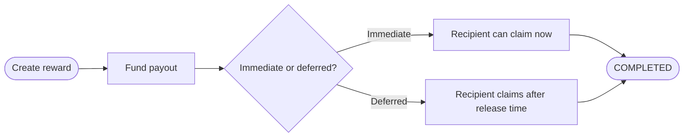

Rewards are one-off or deferred contributor payouts aimed at a known wallet. In the current product, they are presented as a simple distribution pattern rather than a large campaign or long-running stream.

## Use Cases

- achievement rewards
- referral bonuses
- contributor appreciation payouts
- one-time incentives

## How It Works

## Current Product Model

Rewards in the app are usually expressed as:

- immediate single-recipient claims
- deferred one-time payouts
- treasury-funded recognition or bonus distributions

## Key Properties

| Property                            | Detail                                            |
| ----------------------------------- | ------------------------------------------------- |
| Recipient                           | Specific wallet, known at creation time           |
| Timing                              | Immediate or scheduled                            |
| Best fit                            | bonuses, contributor rewards, targeted incentives |
| Use recurring payments instead when | the payout repeats on a schedule                  |

## Contract Library Note

FlowGuard also ships a dedicated `RewardCovenant` in the contract library. The concept page here describes the current end-user reward experience first, while the contract reference covers the lower-level covenant design.
