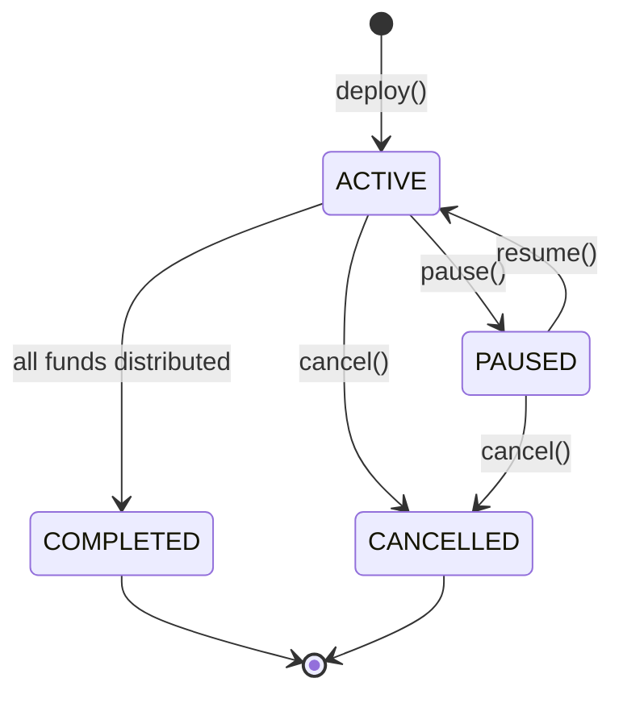

Every FlowGuard covenant — vesting, recurring payment, airdrop, grant, bounty, reward — follows the same status lifecycle and flags bitmap. This consistency means the same indexer, explorer, and frontend can handle all products uniformly.

## Status Transitions



## Status Values

| Status | Byte | Description |
|---|---|---|
| `ACTIVE` | `0x00` | Normal operating state. All function paths available. |
| `PAUSED` | `0x01` | Frozen by authority. Claims and payments blocked. |
| `CANCELLED` | `0x02` | Terminated early. Remaining funds returned to sender/authority. |
| `COMPLETED` | `0x03` | All obligations fulfilled. UTXO consumed, no NFT output produced. |

## Flags Bitmap

The `flags` byte at position `[1]` of every NFT commitment is a bitfield:

| Bit | Hex | Name | Effect |
|---|---|---|---|
| 0 | `0x01` | `FLAG_CANCELABLE` | Sender/authority may call `cancel()` |
| 1 | `0x02` | `FLAG_TRANSFERABLE` | Recipient may call `transfer()` to reassign |
| 2 | `0x04` | `FLAG_USES_TOKENS` | Covenant holds CashToken FTs, not BCH |

### Examples

```
0x05 = 0b00000101 = FLAG_CANCELABLE + FLAG_USES_TOKENS
       Cancelable CashToken stream

0x07 = 0b00000111 = FLAG_CANCELABLE + FLAG_TRANSFERABLE + FLAG_USES_TOKENS
       Cancelable, transferable CashToken vesting stream

0x00 = Non-cancelable BCH payment (irrevocable)
```

## Terminal State Behavior

When a covenant reaches `COMPLETED` or `CANCELLED`:

- The input NFT UTXO is **consumed** by the spending transaction
- **No replacement NFT output** is created — the covenant ends
- The indexer marks the record as terminated
- The explorer shows final state with the completion transaction hash

<Info>
Terminal state transactions do not include a covenant UTXO output. This is how both the indexer and the explorer detect that a covenant has ended.
</Info>

## Pause and Resume

Pausing does not discard accumulated state. For vesting covenants, pausing records `pause_start` and resuming advances the `cursor` by the elapsed pause duration — so paused time is excluded from the vesting calculation.

For recurring payments, resuming resets `next_payment_timestamp` to `now + intervalSeconds`, so no backdated intervals are paid for the pause period.
