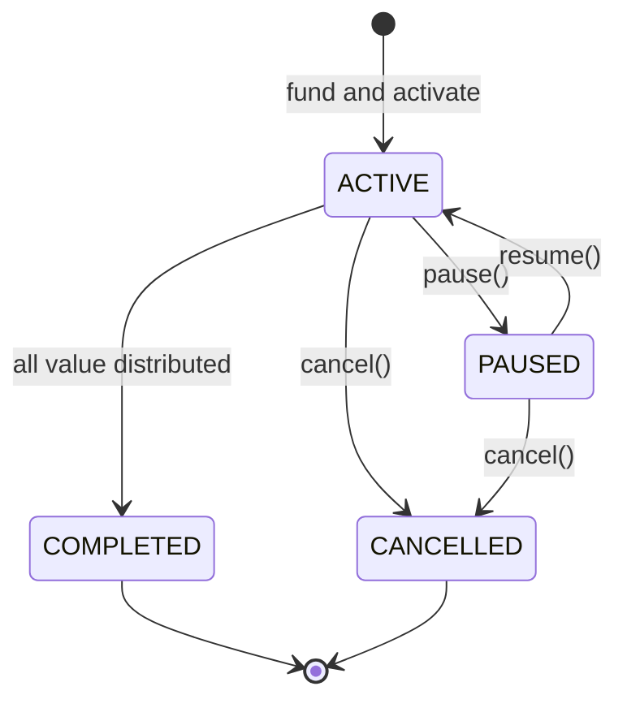

FlowGuard stream and payout contracts share a common lifecycle and flags model. This consistency lets the indexer, explorer, API, and frontend handle multiple covenant families with one state model.

## Status Transitions


```mermaid
stateDiagram-v2
    [*] --> ACTIVE : fund and activate
    ACTIVE --> PAUSED : pause()
    PAUSED --> ACTIVE : resume()
    ACTIVE --> CANCELLED : cancel()
    PAUSED --> CANCELLED : cancel()
    ACTIVE --> COMPLETED : all value distributed
    COMPLETED --> [*]
    CANCELLED --> [*]
```

## Status Values

| Status      | Byte   | Meaning                                                                              |
| ----------- | ------ | ------------------------------------------------------------------------------------ |
| `ACTIVE`    | `0x00` | Normal operating state. Claims and supported controls are available.                 |
| `PAUSED`    | `0x01` | Progression is frozen by sender authority.                                           |
| `CANCELLED` | `0x02` | The stream ended early and remaining value was returned according to contract rules. |
| `COMPLETED` | `0x03` | The covenant finished and no replacement state UTXO was produced.                    |

## Flags Bitmap

The `flags` byte at position `[1]` of the mutable NFT commitment is a bitfield:

| Bit | Hex    | Name                | Effect                                                  |
| --- | ------ | ------------------- | ------------------------------------------------------- |
| 0   | `0x01` | `FLAG_CANCELABLE`   | Sender controls may cancel the stream                   |
| 1   | `0x02` | `FLAG_TRANSFERABLE` | Recipient may transfer future rights to a new recipient |
| 2   | `0x04` | `FLAG_USES_TOKENS`  | The covenant escrows CashTokens instead of BCH          |

### Examples

```
0x05 = cancelable CashToken stream
0x07 = cancelable, transferable CashToken vesting stream
0x00 = non-cancelable BCH stream
```

## Pause and Resume Behavior

- **Vesting-based schedules** exclude paused time from future vesting math by advancing the effective cursor on resume.
- **Recurring schedules** keep their cadence state in the recurring commitment and resume from the updated recurring window.

## Terminal States

When a contract reaches `COMPLETED` or `CANCELLED`:

- the existing covenant UTXO is consumed
- no replacement mutable NFT state output is created
- indexers and explorers treat the stream as terminal

<Info>
  Terminal status is detected from the transaction structure as well as from the persisted record.
  The covenant ends when the state UTXO is consumed without a replacement state output.
</Info>
