`VestingCovenant` enforces token or BCH vesting schedules on-chain. Two schedule types are supported: linear (continuous pro-rata release) and step (discrete periodic unlocks).

## Schedule Types

<CardGroup cols={2}>
  <Card title="Linear Vesting" icon="chart-line">
    Tokens vest continuously proportional to elapsed time. At any moment, the claimable amount is `totalAmount × elapsed / duration − alreadyReleased`.
  </Card>
  <Card title="Step Vesting" icon="stairs">
    Tokens release in discrete chunks every `stepInterval` seconds. Claimable = `completedSteps × stepAmount − alreadyReleased`.
  </Card>
</CardGroup>

## Cliff

When `cliffTimestamp > 0`, no claims are allowed before that time. The cliff is enforced by the contract via `require(tx.locktime >= cliffTimestamp)`. After the cliff passes, all vested-since-start tokens become claimable at once.

```mermaid
gantt
    title Vesting Timeline (Linear with Cliff)
    dateFormat X
    axisFormat %s

    section Cliff Period
    No claims allowed     :0, 30

    section Vesting
    Tokens vest linearly  :30, 100

    section Post-Vesting
    Fully vested          :100, 110
```



## Pause and Resume

When the sender pauses a vesting stream, `pause_start` is recorded in the NFT commitment. On resume, the `cursor` advances by `(resumeTime - pause_start)`, effectively excluding the paused duration from all future vested-amount calculations.

```
newCursor = cursor + (tx.locktime - pause_start)
vestedAmount = totalAmount × (tx.locktime - newCursor) / duration
```

## Cancel

Cancellation splits the remaining pool at the moment of cancellation:
- **Vested (unclaimed)** → recipient
- **Unvested** → sender

The split is calculated using the same formula as `claim()` at the cancellation timestamp.

## Transfer

If `FLAG_TRANSFERABLE` (`0x02`) is set, the current recipient can reassign the stream to a new `bytes20` recipient hash. The current recipient must sign. The NFT commitment `recipient_hash` field is updated in place.

## NFT State (40 bytes)

```
[0]:    status
[1]:    flags
[2-9]:  total_released (uint64)
[10-14]: cursor (5 bytes, unix timestamp)
[15-19]: pause_start (5 bytes, 0 if not paused)
[20-39]: recipient_hash (bytes20)
```
