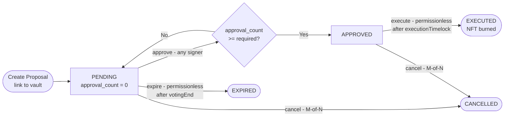

A spending proposal routes a payout through an on-chain approval process before execution. The `ProposalCovenant` tracks approvals and enforces an execution timelock.

## Full Lifecycle



## Create a Proposal

<Steps>
  <Step title="Navigate to Proposals">
    Go to **Vault → Proposals → Create Proposal**, or navigate to your vault and click **New Proposal**.
  </Step>
  <Step title="Define payout details">
    - **Recipient** — BCH P2PKH address that will receive funds
    - **Payout Amount** — satoshis to transfer
    - **Voting Deadline** — timestamp after which the proposal expires if quorum is not reached
    - **Execution Timelock** — minimum wait after approval before execution
  </Step>
  <Step title="Submit">
    Sign and broadcast. The proposal NFT UTXO is created on-chain. Signers can now visit the proposal to approve.
  </Step>
</Steps>

## Approve a Proposal

Each signer navigates to the proposal detail page and clicks **Approve**. Each approval is an individual on-chain transaction that increments `approval_count` in the NFT state.

Once `approval_count >= requiredApprovals`, status transitions to `APPROVED` automatically.

## Execute a Proposal

After the `executionTimelock` timestamp passes, anyone can call `execute()`. In the FlowGuard app, this button appears on the proposal detail page. The executor service also monitors approved proposals and submits execution transactions automatically.

## Cancel a Proposal

M-of-N signers can cancel at any point while status is PENDING or APPROVED. Cancel is an on-chain transaction that sets status to `CANCELLED`.

## API

```bash
POST /api/proposals
{
  "vaultId": "hex_32_bytes",
  "recipientAddress": "bitcoincash:q...",
  "payoutAmount": 100000000,
  "votingEndTimestamp": 1710000000,
  "executionTimelock": 1710086400
}

POST /api/proposals/:id/approve
POST /api/proposals/:id/execute
POST /api/proposals/:id/cancel
```
