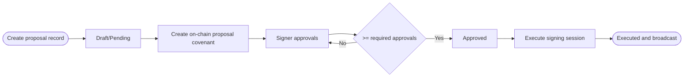

A spending proposal routes a payout through an approval and execution flow. In the current backend, proposal lifecycle is split into:

- Off-chain metadata + signer tracking in SQLite
- On-chain proposal covenant deployment and execution

## Full Lifecycle



## Create a Proposal

<Steps>
  <Step title="Navigate to Proposals">
    Go to **Vault → Proposals → Create Proposal**, or navigate to your vault and click **New Proposal**.
  </Step>
  <Step title="Define payout details">
    - **Recipient**: BCH P2PKH address that will receive funds
    - **Payout Amount**: BCH amount to transfer
    - **Reason**: short payout rationale stored with the proposal record
  </Step>
  <Step title="Submit">
    This creates the proposal record (`POST /api/vaults/:vaultId/proposals`).
    Then fund the on-chain proposal covenant using:
    `POST /api/:id/create-onchain` and
    `POST /api/:id/confirm-create`.
  </Step>
</Steps>

## Approve a Proposal

Each signer clicks **Approve** in the proposal UI.

- Build approval tx: `POST /api/:id/approve-onchain`
- Confirm approval: `POST /api/:id/confirm-approval`

Once approvals reach the required threshold, status transitions to `approved`.

## Execute a Proposal

Execution uses a 2-signer session:

- Start session: `POST /api/:id/execute`
- Submit first/second signed tx: `POST /api/:id/execute-signature`

When enough signatures are collected, backend broadcasts the final transaction and marks proposal executed.

## Current API Scope

Proposal covenant functions like `cancel()` and `expire()` exist at contract level, but the current public HTTP API focuses on create/approve/execute flow.


## API

```bash
POST /api/vaults/:vaultId/proposals
POST /api/:id/create-onchain
POST /api/:id/confirm-create
POST /api/:id/approve-onchain
POST /api/:id/confirm-approval
POST /api/:id/execute
POST /api/:id/execute-signature
```
