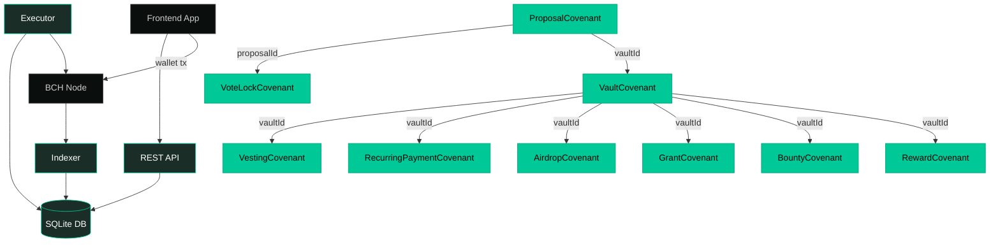
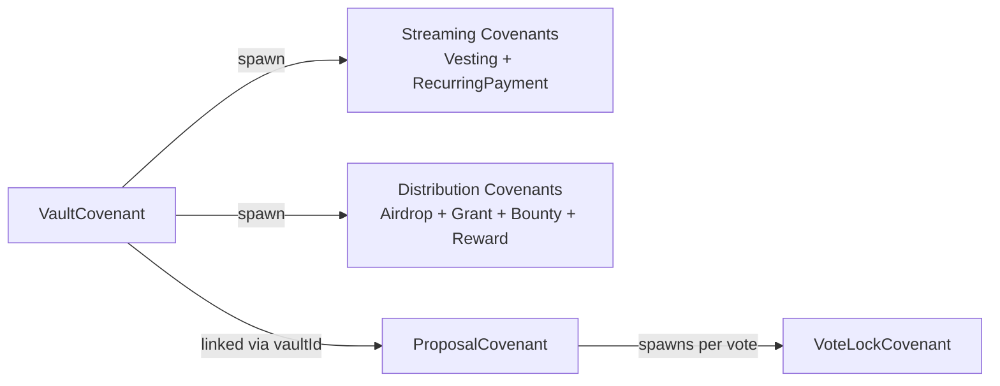
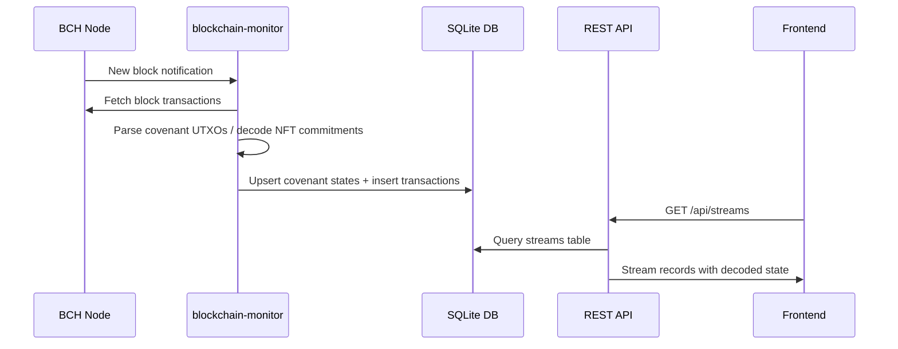
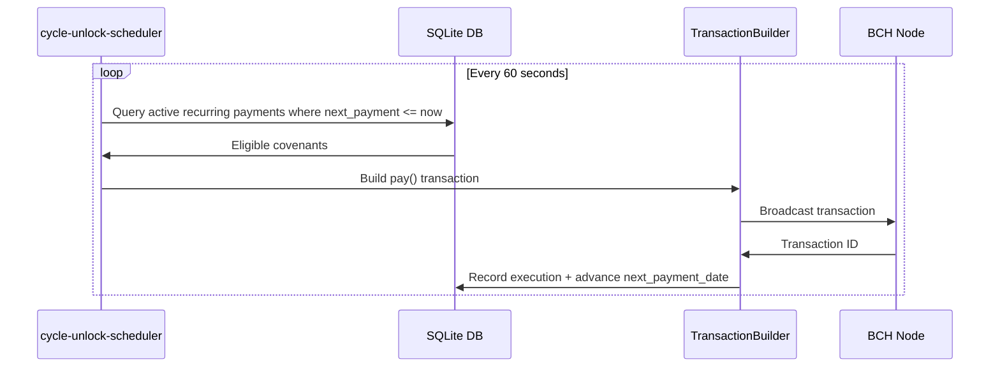

## System Overview

FlowGuard is composed of three layers: on-chain contracts, an off-chain backend (API + indexer + executor), and a frontend app.

## Contract Dependency Map

## NFT Commitment Sizes

| Contract | Commitment Size |
|-|-|
| VaultCovenant | 32 bytes |
| ProposalCovenant | 40 bytes |
| VestingCovenant | 40 bytes |
| RecurringPaymentCovenant | 40 bytes |
| AirdropCovenant | 40 bytes |
| GrantCovenant | 40 bytes |
| BountyCovenant | 40 bytes |
| RewardCovenant | 40 bytes |
| VoteLockCovenant | 32 bytes |

All commitments are within the CashTokens 40-byte hard limit.

## Indexer Data Flow

## Executor Flow

## Backend Service Map

| Service | Responsibility |
|-|-|
| `StreamDeploymentService` | Deploy `VestingCovenant` and `RecurringPaymentCovenant` |
| `StreamClaimService` | Build `claim()` transactions for vesting |
| `StreamCancelService` | Build `cancel()` transactions |
| `StreamFundingService` | Fund existing stream UTXOs |
| `PaymentDeploymentService` | Deploy `RecurringPaymentCovenant` |
| `PaymentClaimService` | Build `pay()` transactions |
| `PaymentControlService` | Pause, resume, cancel payments |
| `AirdropDeploymentService` | Deploy `AirdropCovenant` |
| `AirdropClaimService` | Build `claim()` for airdrop self-service |
| `AirdropControlService` | Authority pause/resume/cancel |
| `BudgetDeploymentService` | Deploy Grant, Bounty, Reward covenants |
| `BudgetReleaseService` | Release milestones, issue rewards, approve bounty claims |
| `VaultFundingService` | Fund vault UTXOs |
| `VoteDeploymentService` | Deploy `VoteLockCovenant` |
| `VoteLockService` | Lock governance tokens |
| `VoteUnlockService` | Reclaim after unlock time |
| `ProposalService` | Full proposal lifecycle management |
| `DeploymentRegistryService` | Track all covenant deployments |
| `TransactionMonitor` | Confirm and track submitted transactions |
| `MerkleTreeService` | Merkle tree generation for airdrop eligibility |
| `cycle-unlock-scheduler` | Executor loop for recurring payments |
